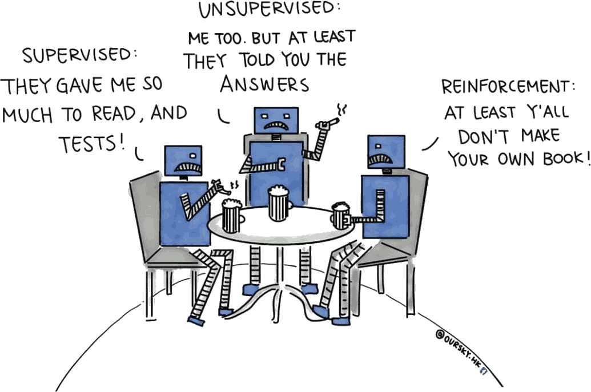
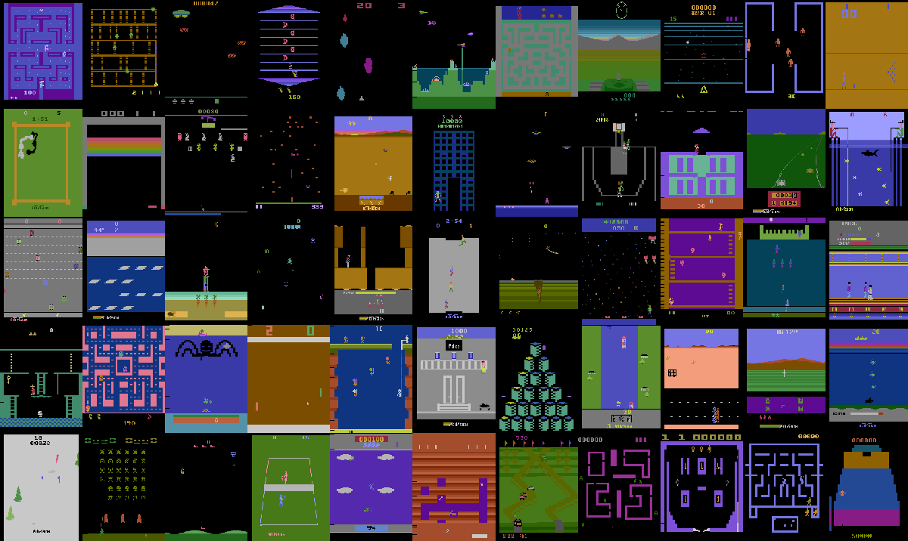
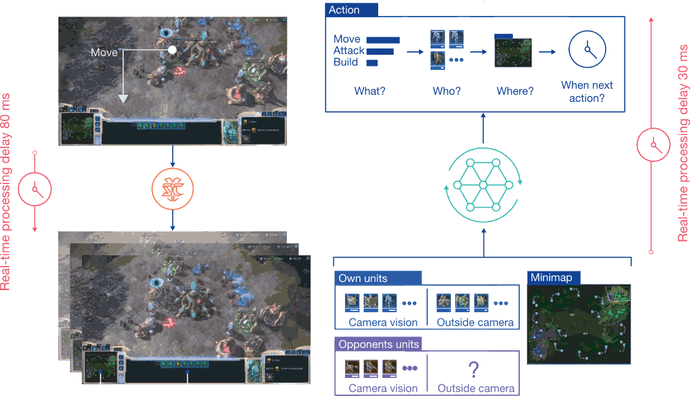
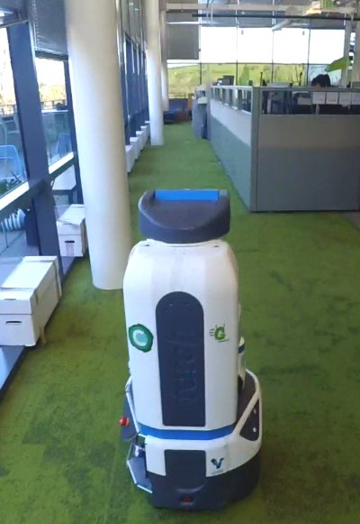
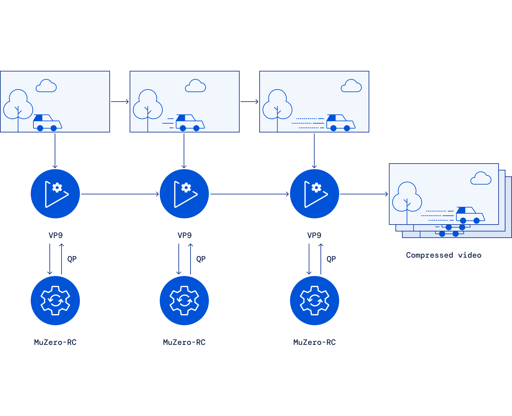
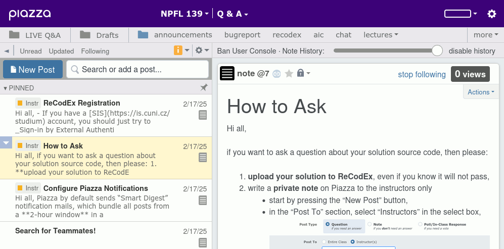
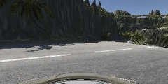
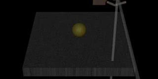

title: NPFL139, Lecture 1
class: title, langtech, cc-by-sa
# Introduction to Reinforcement Learning

## Milan Straka

### February 19, 2025

---
# Reinforcement Learning

**Reinforcement learning** is a machine learning paradigm, different from
_supervised_ and _unsupervised learning_.

~~~
The essence of reinforcement learning is to learn from _interactions_ with the
environment to maximize a numeric _reward_ signal.
~~~
The learner is not told which actions to take, and the actions may affect not
just the immediate reward, but also all following rewards.

~~~

---
# Deep Reinforcement Learning

In the last decade, reinforcement learning has been successfully combined with
_deep NNs_.

~~~

~~~

~~~

~~~

~~~

~~~

~~~

~~~

---
section: Organization
class: section
# Organization

---
# Organization

**Course Website:** https://ufal.mff.cuni.cz/courses/npfl139
~~~
  - Slides, recordings, assignments, exam questions
~~~

**Course Repository:** https://github.com/ufal/npfl139
- Templates for the assignments, slide sources.

~~~

## Piazza

- Piazza will be used as a communication platform.

  You can post questions or notes,
  - **privately** to the instructors,
~~~
  - **publicly** to everyone (signed or anonymously).
~~~
    - Other students can answer these too, which allows you to get faster
      response.
~~~
    - However, **do not include even parts of your source code** in public
      questions.
~~~

- Please use Piazza for **all communication** with the instructors.
~~~
- You will get the invite link after the first lecture.

---
# ReCodEx

https://recodex.mff.cuni.cz

- The assignments will be evaluated automatically in ReCodEx.
~~~
- If you have a MFF SIS account, you should be able to create an account
  using your CAS credentials and should automatically see the right group.
~~~
- Otherwise, there will be **instructions** on **Piazza** how to get
  ReCodEx account (generally you will need to send me a message with several
  pieces of information and I will send it to ReCodEx administrators in
  batches).

---
# Course Requirements

## Practicals
~~~

- There will be about 2-3 assignments a week, each with a 2-week deadline.
~~~
  - There is also another week-long second deadline, but for fewer points.
~~~
- After solving the assignment, you get non-bonus points, and sometimes also
  bonus points.
~~~
- To pass the practicals, you need to get **80 non-bonus points**. There will be
  assignments for at least 120 non-bonus points.
~~~
- If you get more than 80 points (be it bonus or non-bonus), they will be
  all transferred to the exam. Additionally, if you solve **all the
  assignments**, you pass the exam with grade 1.

~~~
## Lecture

You need to pass a written exam (or solve all the assignments).
~~~
- All questions are publicly listed on the course website.
~~~
- There are questions for 100 points in every exam, plus the surplus
  points from the practicals and plus at most 10 surplus points for **community
  work** (improving slides, …).
~~~
- You need 60/75/90 points to pass with grade 3/2/1.

---
# Organization

- Both the lectures and the practicals are recorded.

~~~

## Consultations

- Regular consultations are part of the course schedule.

  - Wednesday, 14:00, S9
~~~
  - However, the consultations are **completely voluntary**.

~~~
- The consultations take place on the last day of assignment deadlines.

~~~
- The consultations are not recorded and have no predefined content.

~~~
- The consultations start on the **second week** of the semester.

---
section: History
class: section
# History of Reinforcement Learning

---
# History of Reinforcement Learning

_Develop goal-seeking agent trained using reward signal._

~~~
- _Optimal control_ in 1950s – Richard Bellman

~~~
- Trial and error learning – since 1850s
  - Law and effect – Edward Thorndike, 1911
    - Responses that produce a satisfying effect in a particular situation become
      more likely to occur again in that situation, and responses that produce
      a discomforting effect become less likely to occur again in that situation
  - Shannon, Minsky, Clark&Farley, … – 1950s and 1960s
  - Tsetlin, Holland, Klopf – 1970s
  - Sutton, Barto – since 1980s

~~~
- Arthur Samuel – first implementation of temporal difference methods
  for playing checkers

~~~
## Notable successes
- Gerry Tesauro – 1992, human-level Backgammon program trained solely by self-play

~~~
- IBM Watson in Jeopardy – 2011

---
# History of Deep Reinforcement Learning
## Deep Reinforcement Learning – Atari Games

- Human-level video game playing (DQN) – 2013 (2015 Nature), Mnih. et al, Deepmind

  - 29 games out of 49 comparable or better to professional game players
  - 8 days on GPU
  - human-normalized mean: 121.9%, median: 47.5% on 57 games

~~~
- A3C – 2016, Mnih. et al
  - 4 days on 16-threaded CPU
  - human-normalized mean: 623.0%, median: 112.6% on 57 games

~~~
- Rainbow – 2017
  - human-normalized median: 153%; ~39 days of game play experience

~~~
- Impala – Feb 2018
  - one network and set of parameters to rule them all
  - human-normalized mean: 176.9%, median: 59.7% on 57 games

~~~
- PopArt-Impala – Sep 2018
  - human-normalized median: 110.7% on 57 games; 57*38.6 days of experience

---
# History of Deep Reinforcement Learning
## Deep Reinforcement Learning – Atari Games

- R2D2 – Jan 2019

  - human-normalized mean: 4024.9%, median: 1920.6% on 57 games
  - processes ~5.7B frames during a day of training
~~~
- Agent57 - Mar 2020
  - super-human performance on all 57 Atari games
~~~
- Data-efficient approaches learning from ~2 hours of game experience

  - SimPLE – Mar 2019, 14.4% median
~~~
  - data-efficient Rainbox – Jun 2019, 20.4% median
~~~
  - EfficientMuZero – Nov 2021, 109% median

---
# History of Deep Reinforcement Learning
## Deep Reinforcement Learning – Board Games

- AlphaGo

  - Mar 2016 – beat 9-dan professional player Lee Sedol

~~~
- AlphaGo Master – Dec 2016
  - beat 60 professionals, beat Ke Jie in May 2017
~~~
- AlphaGo Zero – 2017
  - trained only using self-play
  - surpassed all previous version after 40 days of training
~~~
- AlphaZero – Dec 2017 (Dec 2018 in Nature)
  - self-play only, defeated AlphaGo Zero after 30 hours of training
  - impressive chess and shogi performance after 9h and 12h, respectively

---
# History of Deep Reinforcement Learning
## Deep Reinforcement Learning – 3D Games

- Dota2 – Aug 2017

  - OpenAI bot won Dota2 1v1 matches against a professional player

~~~
- MERLIN – Mar 2018
  - unsupervised representation of states using external memory
  - beat human in unknown maze navigation

~~~
- FTW – Jul 2018
  - beat professional players in two-player-team Capture the flag FPS
  - solely by self-play, trained on 450k games

~~~
- OpenAI Five – Aug 2018
  - won Dota2 5v5 best-of-three match against professional team
  - 256 GPUs, 128k CPUs, 180 years of experience per day

~~~
- AlphaStar
  - Jan 2019: won 10 out of 11 StarCraft II games against two professional players
  - Oct 2019: ranked 99.8% on `Battle.net`, playing with full game rules

---
# History of Deep Reinforcement Learning
## Deep Reinforcement Learning – Other Applications

- Optimize non-differentiable loss

  - improved translation quality in 2016
  - better summarization performance

~~~
- Neural architecture search (since Nov 2016)
  - SoTA CNN architecture generated by another network
  - can search also for suitable RL architectures, new activation functions,
    optimizers…

~~~
- Controlling cooling in Google datacenters directly by AI (2018)
  - reaching 30% cost reduction

~~~
- Designing the layout of TPU chips (AlphaChip; since 2021, opensourced)

~~~
- Improving efficiency of VP9 codec (2022; 4% in bandwith with no loss in
  quality)

~~~
- Discovering faster algorithms for matrix multiplication (AlphaTensor, Oct 2022),
  sorting (AlphaDev, June 2023)

~~~
- Searching for solutions of mathematical problems (FunSearch, Dec 2023)

---
# History of Deep Reinforcement Learning

- Reinforcement learning from human feedback (RLHF) is used to train chatbots

~~~
- Improving reasoning of LLMs (DeepSeek R1), proving math theorems (AlphaGeometry 2)

---
# History of Deep Reinforcement Learning

Note that the machines learn just to obtain a reward we have defined,
they do not learn what we want them to.

- [Hide and seek](https://openai.com/blog/emergent-tool-use/#surprisingbehaviors)

~~~

~~~

---
section: Bandits
class: section
# Multi-armed Bandits

---
# Multi-armed Bandits

---
class: middle
# Multi-armed Bandits

---
# Multi-armed Bandits

We start by selecting an action $A_1$ (the index of the arm to use), and we
obtain a reward $R_1$. We then repeat the process by selecting an action $A_2$,
obtaining $R_2$, selecting $A_3$, …, with the indices denoting the time step
when the actions and rewards occurred.

~~~
Let $q_*(a)$ be the real **value** of an action $a$:
$$q_*(a) = 𝔼[R_t | A_t = a].$$

~~~

Denoting $Q_t(a)$ our estimated value of action $a$ at time $t$ (before taking
trial $t$), we would like $Q_t(a)$ to converge to $q_*(a)$. A natural way to
estimate $Q_t(a)$ is
$$Q_t(a) ≝ \frac{\textrm{sum of rewards when action }a\textrm{ is taken}}{\textrm{number of times action }a\textrm{ was taken}}.$$

~~~
Following the definition of $Q_t(a)$, we could choose a **greedy** action $A_t$ as
$$A_t ≝ \argmax_a Q_t(a).$$

---
section: $ε$-greedy
# $ε$-greedy Method

## Exploitation versus Exploration

Choosing a greedy action is **exploitation** of current estimates. We however also
need to **explore** the space of actions to improve our estimates.

~~~

An _$ε$-greedy_ method follows the greedy action with probability $1-ε$, and
chooses a uniformly random action with probability $ε$.

---
# $ε$-greedy Method

Considering the 10-armed bandit problem:

- we generate 2000 random instances

  - each $q_*(a)$ is sampled from $𝓝(0, 1)$

~~~
- for every instance, we run 1000 steps of the $ε$-greedy method
  - we consider $ε$ of 0, 0.01, 0.1

~~~
- we plot the averaged results over the 2000 instances

---
# $ε$-greedy Method

## Incremental Implementation

Let $Q_{n+1}$ be an estimate using $n$ rewards $R_1, \ldots, R_n$.

$$\begin{aligned}
Q_{n+1} &= \frac{1}{n} ∑_{i=1}^n R_i \\
    &= \frac{1}{n} (R_n + \frac{n-1}{n-1} ∑_{i=1}^{n-1} R_i) \\
    &= \frac{1}{n} (R_n + (n-1) Q_n) \\
    &= \frac{1}{n} (R_n + n Q_n - Q_n) \\
    &= Q_n + \frac{1}{n}\Big(R_n - Q_n\Big)
\end{aligned}$$

---
# $ε$-greedy Method Algorithm

---
# Fixed Learning Rate

Analogously to the solution obtained for a stationary problem, we consider
$$Q_{n+1} = Q_n + α(R_n - Q_n).$$

~~~
Converges to the true action values if
$$∑_{n=1}^∞ α_n = ∞ \textrm{~~~~and~~~~}∑_{n=1}^∞ α_n^2 < ∞.$$

~~~
Biased method, because
$$Q_{n+1} = (1 - α)^n Q_1 + ∑_{i=1}^n α(1-α)^{n-i} R_i.$$

~~~
The bias can be utilized to support exploration at the start of the episode by
setting the initial values to more than the expected value of the optimal
solution.

---
# Optimistic Initial Values and Fixed Learning Rate

---
# Method Comparison

---
section: MDP
class: section
# Markov Decision Process

---
# Markov Decision Process

~~~~
# Markov Decision Process

A **Markov decision process** (MDP) is a quadruple $(𝓢, 𝓐, p, γ)$,
where:
- $𝓢$ is a set of states,
~~~
- $𝓐$ is a set of actions,
~~~
- $p(S_{t+1} = s', R_{t+1} = r | S_t = s, A_t = a)$ is a probability that
  action $a ∈ 𝓐$ will lead from state $s ∈ 𝓢$ to $s' ∈ 𝓢$, producing a **reward** $r ∈ ℝ$,
~~~
- $γ ∈ [0, 1]$ is a **discount factor**.

~~~
Let a **return** $G_t$ be $G_t ≝ ∑_{k=0}^∞ γ^k R_{t + 1 + k}$. The goal is to optimize $𝔼[G_0]$.

---
# Markov Decision Process

We cannot replace
- $p(S_{t+1} = s', R_{t+1} = r | S_t = s, A_t = a)$ is a probability that
  action $a ∈ 𝓐$ will lead from state $s ∈ 𝓢$ to $s' ∈ 𝓢$, producing a **reward** $r ∈ ℝ$,

by
- $p(S_{t+1} = s' | S_t = s, A_t = a)$, a transition probability,
- $r(R_{t+1} = r | S_t = s, A_t = a)$, a reward probability.

~~~
because the reward might depend on $S_{t+1}$.

~~~
However, we could use
- $p(S_{t+1} = s' | S_t = s, A_t = a)$, a transition probability,
- $r(R_{t+1} = r | S_{t+1} = s', S_t = s, A_t = a)$, a reward probability.

---
# Multi-armed Bandits as MDP

To formulate $n$-armed bandits problem as MDP, we do not need states.
Therefore, we could formulate it as:
- one-element set of states, $𝓢=\{S\}$;
~~~
- an action for every arm, $𝓐=\{a_1, a_2, …, a_n\}$;
~~~
- assuming every arm produces rewards with a distribution of $𝓝(μ_i, σ_i^2)$,
  the MDP dynamics function $p$ is defined as
  $$p(S, r | S, a_i) = 𝓝(r | μ_i, σ_i^2).$$

~~~
One possibility to introduce states in multi-armed bandits problem is to
consider a separate reward distribution for every state. Such generalization is
called **Contextualized Bandits** problem. Assuming state transitions are
independent on rewards and given by a distribution $\textit{next}(s)$, the MDP
dynamics function for contextualized bandits problem is given by
$$p(s', r | s, a_i) = 𝓝(r | μ_{i,s}, σ_{i,s}^2) ⋅ \textit{next}(s'|s).$$

---
section: POMDP
# Partially Observable MDPs

Recall that the Markov decision process is a quadruple $(𝓢, 𝓐, p, γ)$,
where:
- $𝓢$ is a set of states,
- $𝓐$ is a set of actions,
- $p(S_{t+1} = s', R_{t+1} = r | S_t = s, A_t = a)$ is a probability that
  action $a ∈ 𝓐$ will lead from state $s ∈ 𝓢$ to $s' ∈ 𝓢$, producing a reward $r ∈ ℝ$,
- $γ ∈ [0, 1]$ is a discount factor.

~~~

**Partially observable Markov decision process** extends the Markov decision
process to a sextuple $(𝓢, 𝓐, p, γ, 𝓞, o)$, where in addition to an MDP,
- $𝓞$ is a set of observations,
- $o(O_{t+1} | S_{t+1}, A_t)$ is an observation model, where observation $O_t$ is used as agent input
  instead of the state $S_t$.

---
section: POMDP
# Partially Observable MDPs

Planning in a general POMDP is in theory undecidable.
~~~
- Nevertheless, several approaches are used to handle POMDPs in robotics
  - to model uncertainty, imprecise mechanisms and inaccurate sensors, …
  - consider for example robotic vacuum cleaners

~~~

Partially observable MDPs are needed to model many environments
(maze navigation, FPS games, …).
~~~
- We will initially assume all environments are fully observable, even if some
  of them will not.
~~~
- Later we will mention solutions, where partially observable MDPs are handled
  using recurrent networks (or networks with external memory), which model the
  latent states $S_t$.

---
section: MDP
# Episodic and Continuing Tasks

If the agent-environment interaction naturally breaks into independent
subsequences, usually called **episodes**, we talk about **episodic tasks**.
Each episode then ends in a special **terminal state**, followed by a reset
to a starting state (either always the same, or sampled from a distribution
of starting states).

~~~
In episodic tasks, it is often the case that every episode ends in at most
$H$ steps. These **finite-horizon tasks** then can use discount factor $γ=1$,
because the return $G ≝ ∑_{t=0}^H γ^t R_{t + 1}$ is well defined.

~~~
If the agent-environment interaction goes on and on without a limit, we instead
talk about **continuing tasks**. In this case, the discount factor $γ$ needs
to be sharply smaller than 1.

---
section: Value Functions
class: section
# Value Function and Action-Value Function

---
# (State-)Value Function and Action-Value Function

A **policy** $π$ computes a distribution of actions in a given state, i.e.,
$π(a | s)$ corresponds to a probability of performing an action $a$ in state
$s$.

~~~
To evaluate a quality of a policy, we define **value function** $v_π(s)$, or
**state-value function**, as
$$\begin{aligned}
  v_π(s) & ≝ 𝔼_π\big[G_t \big| S_t = s\big] = 𝔼_π\left[∑\nolimits_{k=0}^∞ γ^k R_{t+k+1} \middle| S_t=s\right] \\
         & = 𝔼_{A_t ∼ π(s)} 𝔼_{S_{t+1},R_{t+1} ∼ p(s,A_t)} \big[R_{t+1}
           + γ 𝔼_{A_{t+1} ∼ π(S_{t+1})} 𝔼_{S_{t+2},R_{t+2} ∼ p(S_{t+1},A_{t+1})} \big[R_{t+2} + … \big]\big]
\end{aligned}$$

~~~
An **action-value function** for a policy $π$ is defined analogously as
$$q_π(s, a) ≝ 𝔼_π\big[G_t \big| S_t = s, A_t = a\big] = 𝔼_π\left[∑\nolimits_{k=0}^∞ γ^k R_{t+k+1} \middle| S_t=s, A_t = a\right].$$

~~~
The value function and action-value function can be of course expressed using one another:
$$v_π(s) = 𝔼_{a∼π}\big[q_π(s, a)\big],~~~~~~~q_π(s, a) = 𝔼_{s', r ∼ p}\big[r + γv_π(s')\big].$$

---
# (State-)Value Function and Action-Value Function

Consider the following simple gridworld environment:
- the cells corresponding to states
- four actions _north_, _east_, _south_, _west_ available from all states
- reward -1 when action would take an agent off the grid (no movement in that
  case)
- reward +10 and +5 in the two special cells below, with the next state
  always the indicated one independently on the action; reward 0 otherwise
- discount $γ = 0.9$

---
# Optimal Value Functions

Optimal state-value function is defined as
$$v_*(s) ≝ \max_π v_π(s),$$
~~~
analogously
$$q_*(s, a) ≝ \max_π q_π(s, a).$$

~~~
Any policy $π_*$ with $v_{π_*} = v_*$ is called an **optimal policy**. Such policy
can be defined as $π_*(s) ≝ \argmax_a q_*(s, a) = \argmax_a 𝔼\big[R_{t+1} + γv_*(S_{t+1}) | S_t = s, A_t = a\big]$.
When multiple actions maximize $q_*(s, a)$, the optimal policy can
stochastically choose any of them.

~~~
## Existence
In finite-horizon tasks or if $γ < 1$, there always exists a unique optimal
state-value function, a unique optimal action-value function, and a (not necessarily
unique) optimal policy.

---
# Optimal Value Functions

Here are the unique optimal value function and non-unique optimal policy
of the gridworld environment from before.

---
section: Monte Carlo Methods
class: section
# Monte Carlo Methods

---
# Monte Carlo Prediction

Assuming we have a fixed policy $π$ and that we want to estimate $v_π(s)$.

~~~
A Monte Carlo method to estimate this value function would be to simulate
many episodes, and then compute an average _return_ for all visited states:
$$V(s) ≈ 𝔼[G_t | S_t = s].$$

~~~
Some states might be visited multiple times; in that case, we could use
~~~
- **first-visit** Monte Carlo method, where only the first occurrence of
  the state is considered;
~~~
- **every-visit** Monte Carlo method, where all occurrences of the state are
  considered.

~~~
By the law of large numbers, the Monte Carlo estimate converges to the
real value function for all visited states.
~~~
- Actually, for every-visit MC, it is more complicated, because multiple returns
  from a single state in a single episode are not independent; but it can be
  proven that even every-visit Monte Carlo converges.

---
# Monte Carlo Prediction of Blackjack

---
# Monte Carlo Control

We now present the first algorithm for computing optimal behavior without assuming
a knowledge of the environment dynamics.

However, we still assume there are finitely many states $𝓢$ and we will store
estimates for each of them (a _tabular_ method).

~~~
Monte Carlo methods are based on estimating returns from complete episodes.
Specifically, they try to estimate
$$Q(s, a) ≈ 𝔼[G_t | S_t = s, A_t = a].$$

~~~
With such estimates, a greedy action in state $S_t$ can be computed as
$$A_t = \argmax_a Q(S_t, a).$$

~~~
To hope for convergence, we need to visit each state-action pair infinitely many times.
One of the simplest way to achieve that is to assume **exploring starts**, where
we randomly select the first state and first action, and behave greedily
afterwards.

---
# Monte Carlo with Exploring Starts

---
# Monte Carlo Predicting Optimal Policy on Blackjack

---
# Monte Carlo and $ε$-soft Behavior

The problem with exploring starts is that in many situations, we either cannot
start in an arbitrary state, or it is impractical.

~~~
Instead of choosing random state at the beginning, we can consider adding
“randomness” gradually – for a given $ε$, we set the probability of choosing any
action to be at least
$$\frac{ε}{|𝓐(s)|}$$
in each step. Such behavior is called _$ε$-soft_.

~~~
In an $ε$-soft behaviour, selecting and action greedily (the $ε$-greedy
behavior) means one action has a maximum probability of
$$1-ε+\frac{ε}{|A(s)|}.$$

~~~
We now present Monte Carlo algorithm with $ε$-greedy action selection.

---
# Monte Carlo for $ε$-soft Behavior

### On-policy every-visit Monte Carlo for $ε$-soft Policies
Algorithm parameter: small $ε>0$

Initialize $Q(s, a) ∈ ℝ$ arbitrarily (usually to 0), for all $s ∈ 𝓢, a ∈ 𝓐$ 
Initialize $C(s, a) ∈ ℤ$ to 0, for all $s ∈ 𝓢, a ∈ 𝓐$

Repeat forever (for each episode):
- Generate an episode $S_0, A_0, R_1, …, S_{T-1}, A_{T-1}, R_T$,
  by generating actions as follows:
  - With probability $ε$, generate a random uniform action
  - Otherwise, set $A_t ≝ \argmax\nolimits_a Q(S_t, a)$
- $G ← 0$
- For each $t=T-1, T-2, …, 0$:
  - $G ← γG + R_{t+1}$
  - $C(S_t, A_t) ← C(S_t, A_t) + 1$
  - $Q(S_t, A_t) ← Q(S_t, A_t) + \frac{1}{C(S_t, A_t)}(G - Q(S_t, A_t))$
